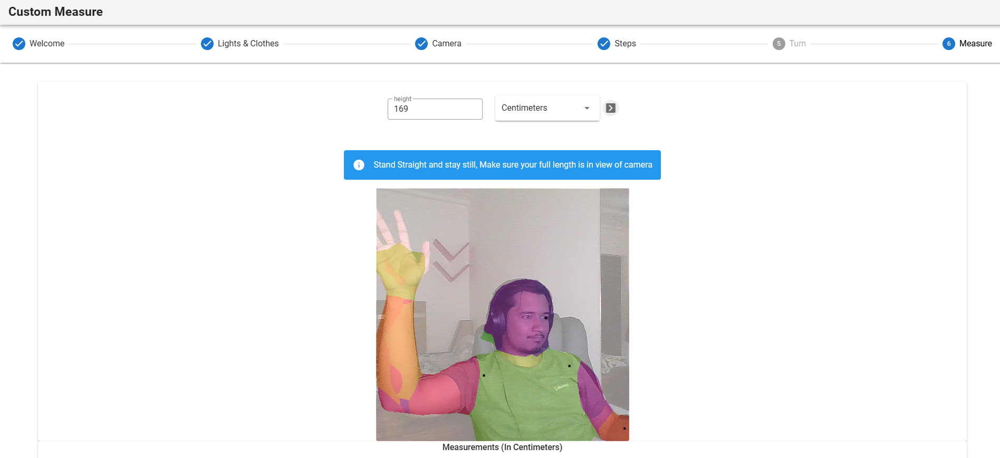

# Segmented Webcam Body Measurement App for Custom-Fitted Shirts

This repository contains the source code for a VueJS static website that calculates the body measurements required for a custom-fitted shirt using webcam input. Powered by TensorFlow.js.

Try here: https://custom-measure.onrender.com



## Features

- Obtain shirt body measurements using just two angles from your webcam
- Real-time measurements with minimal setup
- Built on TensorFlow.js for high accuracy and ease of use
- VueJS powered static website for fast and efficient deployment

## Getting Started

1. Install dependencies:

```bash
npm install
```

2. Run the application in development mode:
```bash
npm run serve
```

3. Build the app for production:


```
npm run build
```

4. Deploy the dist/ directory as a static website.

## How It Works


- The application uses your webcam to capture images from the front and side.

- Images captured are processed through a TensorFlow.js model trained to detect body landmarks. Using body-pix

- Measurements such as chest, waist, and sleeve length are calculated based on detected landmarks and their relative positions.


Note: Consider adding a warning that the app collects webcam images which may contain personal information. Ensure users' privacy by not storing images in any form without explicit consent.


## Contributing

Pull requests are welcome. For major changes, please open an issue first to discuss what you would like to change.


Please make sure to update tests as appropriate.


## License

[MIT](https://choosealicense.com/licenses/mit/)